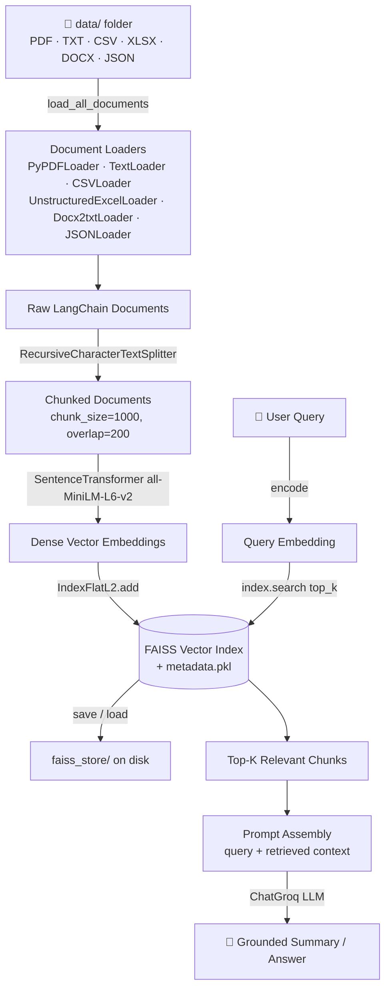
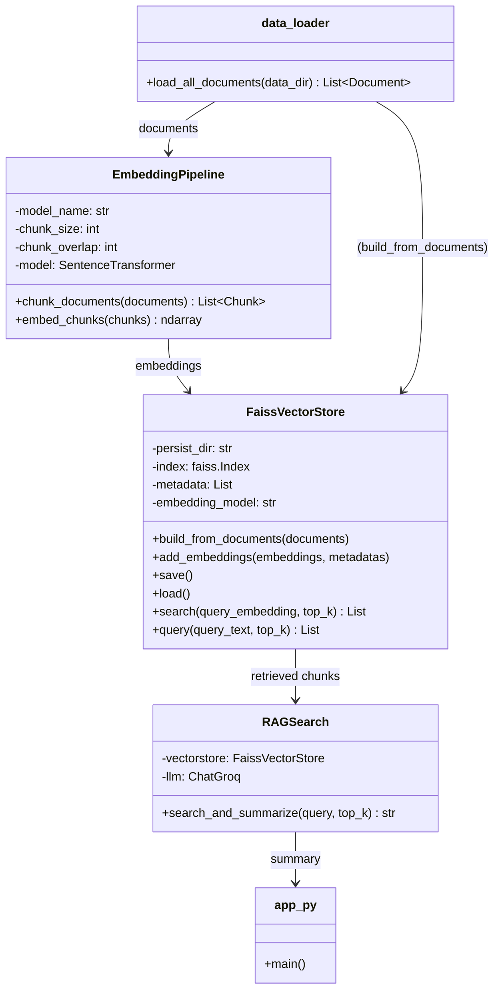
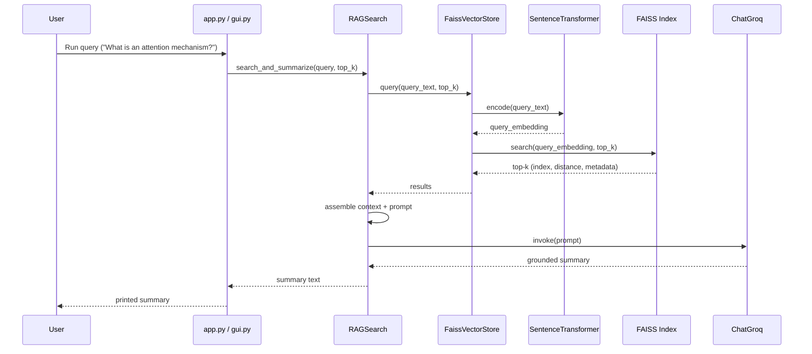

# 📚 Advanced RAG for Research Papers

> A modular **Retrieval-Augmented Generation (RAG)** pipeline purpose-built for querying and summarizing academic research papers (PDF, TXT, CSV, Excel, Word, JSON) using semantic search over a FAISS vector store and Groq-hosted LLMs.

<p align="left">
  
  
  
  
  
  
</p>

---

## 📖 Table of Contents

- [Overview](#-overview)
- [Architecture](#-architecture)
- [How It Works](#-how-it-works)
- [Tech Stack](#-tech-stack)
- [Project Structure](#-project-structure)
- [Installation](#-installation)
- [Usage](#-usage)
- [Module Reference](#-module-reference)
- [Supported File Types](#-supported-file-types)
- [Configuration](#-configuration)
- [Roadmap](#-roadmap)
- [Contributing](#-contributing)
- [License](#-license)

---

## 🔍 Overview

**Advanced RAG for Research Papers** ingests heterogeneous documents (PDFs, plain text, spreadsheets, Word docs, JSON), chunks and embeds them using sentence-transformer embeddings, indexes the vectors in a **FAISS** similarity index, and answers natural-language queries by retrieving the most relevant chunks and passing them to a **Groq-hosted LLM** for grounded summarization.

It is designed as a lightweight, hackable reference implementation of a RAG pipeline — ideal for researchers who want to semantically search across a personal corpus of papers rather than skimming PDFs manually.

**Core capabilities:**

| Capability | Description |
|---|---|
| 🗂️ Multi-format ingestion | Load PDF, TXT, CSV, XLSX, DOCX, and JSON documents from a single data directory |
| ✂️ Smart chunking | Recursive character-based text splitting with configurable overlap |
| 🧠 Semantic embeddings | Sentence-Transformer (`all-MiniLM-L6-v2`) embeddings |
| ⚡ Fast retrieval | FAISS flat L2 index for similarity search |
| 💬 Grounded answers | Groq LLM synthesizes a summary from retrieved context |
| 💾 Persistence | Vector index and metadata persisted to disk and reloaded on demand |
| 🖥️ Streamlit GUI | Dark-themed chat interface with source transparency |

---

## 🏗️ Architecture

### End-to-end pipeline



### Component / class relationship



### Query sequence



---

## ⚙️ How It Works

1. **Ingestion** — `src/data_loader.py` recursively scans the `data/` directory and loads every supported file type into standardized LangChain `Document` objects, with per-file error handling and debug logging.
2. **Chunking** — `src/embedding.py`'s `EmbeddingPipeline` splits documents using `RecursiveCharacterTextSplitter` (default `chunk_size=1000`, `chunk_overlap=200`) so that context windows stay within embedding/LLM limits while preserving semantic continuity.
3. **Embedding** — Each chunk is encoded into a dense vector using the `all-MiniLM-L6-v2` Sentence-Transformer model (384-dim embeddings).
4. **Indexing** — `src/vectorstore.py`'s `FaissVectorStore` stores vectors in a FAISS `IndexFlatL2` index and keeps parallel chunk metadata (`text`, `source`) in a pickled list, persisting both to `faiss_store/`.
5. **Retrieval** — At query time, the query string is embedded with the same model and compared against the index via L2 distance to fetch the `top_k` most similar chunks.
6. **Generation** — `src/search.py`'s `RAGSearch` concatenates retrieved chunk text into a context block and prompts a Groq-hosted LLM (via `langchain-groq`'s `ChatGroq`) to produce a grounded, query-specific summary.

---

## 🧰 Tech Stack

| Layer | Technology | Purpose |
|---|---|---|
| Language | **Python 3.10+** | Core implementation |
| GUI | **Streamlit** | Dark-themed chat web interface |
| Orchestration | **LangChain** (`langchain`, `langchain-core`, `langchain-community`) | Document loaders, text splitting, chaining |
| PDF Parsing | **pypdf**, **pymupdf** | Extracting text from research paper PDFs |
| Embeddings | **sentence-transformers** (`all-MiniLM-L6-v2`) | Dense semantic vector generation |
| Vector Store | **FAISS** (`faiss-cpu`) | Fast approximate/exact nearest-neighbor similarity search |
| Alt. Vector DB | **ChromaDB**, **Typesense** | Available for extension beyond FAISS |
| LLM Provider | **Groq** (`langchain-groq`) | Fast low-latency inference for summarization |
| Alt. LLM Provider | **langchain-openai** | Optional OpenAI-backed generation |
| Agentic Extension | **LangGraph** | Available for building multi-step / agentic RAG flows |
| Config | **python-dotenv** | Environment variable / API key management |
| Notebooks | **Jupyter** (`document.ipynb`, `pdf_loader.ipynb`) | Exploration and prototyping |

### `requirement.txt` (dependency manifest)

```text
langchain
langchain-core
langchain-community
pypdf
pymupdf
sentence-transformers
faiss-cpu
chromadb
langchain-groq
python-dotenv
typesense
langchain_openai
langgraph
streamlit
```
---

## 📁 Project Structure

```text
Advanced-RAG-for-Research-papers/
├── .streamlit/
│   └── config.toml             # Dark theme configuration
├── gui.py                      # Streamlit web interface (chat GUI)
├── app.py                      # CLI entry point
├── main.py                     # (placeholder / reserved entry point)
├── requirement.txt             # Python dependencies
├── data/
│   ├── pdf/                    # Source research paper PDFs
│   └── text_files/             # Plain-text source documents
├── notebook/
│   ├── document.ipynb          # Document loading experiments
│   └── pdf_loader.ipynb        # PDF-loading exploration notebook
└── src/
    ├── __init__.py
    ├── data_loader.py          # Multi-format document ingestion
    ├── embedding.py            # Chunking + embedding pipeline
    ├── vectorstore.py          # FAISS index build/save/load/search
    └── search.py               # Retrieval + Groq LLM summarization (RAGSearch)
```

### Module responsibility matrix

| File | Key Class / Function | Responsibility |
|---|---|---|
| `src/data_loader.py` | `load_all_documents(data_dir)` | Discover and parse PDF/TXT/CSV/XLSX/DOCX/JSON files into `Document` objects |
| `src/embedding.py` | `EmbeddingPipeline` | Chunk documents and generate embeddings |
| `src/vectorstore.py` | `FaissVectorStore` | Build, persist, load, and query the FAISS index |
| `src/search.py` | `RAGSearch` | Orchestrate retrieval + LLM-based summarization |
| `app.py` | — | Example driver script tying all components together |
| `gui.py` | — | Streamlit chat GUI with source transparency |

---

## 🚀 Installation

```bash
# 1. Clone the repository
git clone https://github.com/Themahattva/Advanced-RAG-for-Research-papers.git
cd Advanced-RAG-for-Research-papers

# 2. Create and activate a virtual environment
python -m venv venv
source venv/bin/activate        # Windows: venv\Scripts\activate

# 3. Install dependencies
pip install -r requirement.txt

# 4. Configure environment variables
echo "GROQ_API_KEY=your_groq_api_key_here" > .env
```

> 🔑 **API Key required**: `src/search.py` uses `ChatGroq`, which needs a valid Groq API key. Set it via a `.env` file (loaded with `python-dotenv`).

---

## ▶️ Usage

### 1. Add your research papers

Place PDFs, text files, spreadsheets, Word docs, or JSON files inside `data/` (subfolders like `data/pdf/` and `data/text_files/` are supported since loading is recursive).

### 2. Run the Streamlit GUI (recommended)

```bash
streamlit run gui.py
```

This launches a dark-themed chat application where you can:

- **Upload** research papers (PDF, TXT, CSV, XLSX, DOCX, JSON) via the sidebar
- **Build/rebuild** the FAISS vector index with a single click
- **Ask questions** about your papers and receive grounded answers
- **View sources** — every answer shows the exact document chunks used, with filenames and similarity scores

### 3. Build the vector index (CLI)

```python
from src.data_loader import load_all_documents
from src.vectorstore import FaissVectorStore

docs = load_all_documents("data")
store = FaissVectorStore("faiss_store")
store.build_from_documents(docs)   # chunks, embeds, indexes, and saves to disk
```

### 4. Query and summarize (CLI)

```python
from src.search import RAGSearch

rag_search = RAGSearch()
summary = rag_search.search_and_summarize(
    "What is attention mechanism?",
    top_k=3
)
print(summary)
```

### 5. Run the example driver script

```bash
python app.py
```

Expected flow: loads documents → loads the persisted FAISS store → runs a sample query (`"What is attention mechanism?"`) → prints an LLM-generated, context-grounded summary.

---

## 🧩 Module Reference

### `FaissVectorStore`

| Method | Description |
|---|---|
| `build_from_documents(documents)` | Full pipeline: chunk → embed → index → save |
| `add_embeddings(embeddings, metadatas)` | Add raw vectors + metadata to the index |
| `save()` | Persist `faiss.index` and `metadata.pkl` to `persist_dir` |
| `load()` | Load a previously persisted index + metadata |
| `search(query_embedding, top_k)` | Raw vector search returning index/distance/metadata |
| `query(query_text, top_k)` | Convenience wrapper — embeds text then searches |

### `EmbeddingPipeline`

| Parameter | Default | Description |
|---|---|---|
| `model_name` | `all-MiniLM-L6-v2` | Sentence-Transformer model used for embeddings |
| `chunk_size` | `1000` | Max characters per chunk |
| `chunk_overlap` | `200` | Overlap between consecutive chunks |

### `RAGSearch`

| Parameter | Default | Description |
|---|---|---|
| `persist_dir` | `faiss_store` | Path to the FAISS index directory |
| `embedding_model` | `all-MiniLM-L6-v2` | Embedding model for query encoding |
| `llm_model` | `llama-3.3-70b-versatile` | Groq-hosted model used for summarization |

---

## 📄 Supported File Types

| Format | Loader Used | Extension |
|---|---|---|
| PDF | `PyPDFLoader` | `.pdf` |
| Plain Text | `TextLoader` | `.txt` |
| CSV | `CSVLoader` | `.csv` |
| Excel | `UnstructuredExcelLoader` | `.xlsx` |
| Word | `Docx2txtLoader` | `.docx` |
| JSON | `JSONLoader` | `.json` |

---

## 🔧 Configuration

| Setting | Where | Default | Notes |
|---|---|---|---|
| `GROQ_API_KEY` | `.env` | — | Required for `ChatGroq` LLM calls |
| Embedding model | `EmbeddingPipeline(model_name=...)` | `all-MiniLM-L6-v2` | Swap for any Sentence-Transformer model |
| Chunk size / overlap | `EmbeddingPipeline(chunk_size, chunk_overlap)` | `1000` / `200` | Tune for longer/shorter context windows |
| Vector store path | `FaissVectorStore(persist_dir=...)` | `faiss_store` | Directory for `faiss.index` + `metadata.pkl` |
| LLM model | `RAGSearch(llm_model=...)` | `llama-3.3-70b-versatile` | Any Groq-supported chat model |
| Top-K results | `search_and_summarize(query, top_k=...)` | `5` | Number of retrieved chunks per query |

---

## 🗺️ Roadmap

- [x] Move hardcoded `groq_api_key = ""` in `src/search.py` to `.env`-driven config
- [x] Fix relative import in `vectorstore.py`'s `__main__` block
- [x] Add a Streamlit front-end with dark theme and source transparency
- [x] Add source-citation metadata (filenames) to generated summaries
- [ ] Swap `IndexFlatL2` for an approximate index (`IndexIVFFlat` / `HNSW`) for large corpora
- [ ] Add automated tests and CI
- [ ] Streaming token-by-token answers in the GUI

---

## 🤝 Contributing

Contributions are welcome! To contribute:

1. Fork the repository
2. Create a feature branch (`git checkout -b feature/my-feature`)
3. Commit your changes (`git commit -m "Add my feature"`)
4. Push to the branch (`git push origin feature/my-feature`)
5. Open a Pull Request

---

## 📜 License

This project currently has no explicit license file. Consider adding an [MIT License](https://choosealicense.com/licenses/mit/) or similar to clarify usage terms for contributors and downstream users.

---

<p align="center"><i>Built for researchers who'd rather ask their papers questions than re-read them.</i></p>
